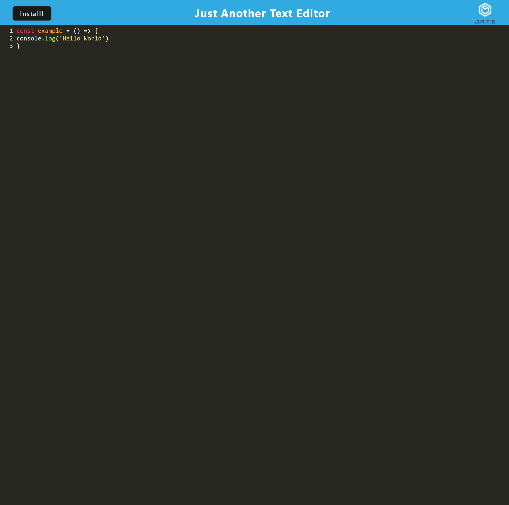
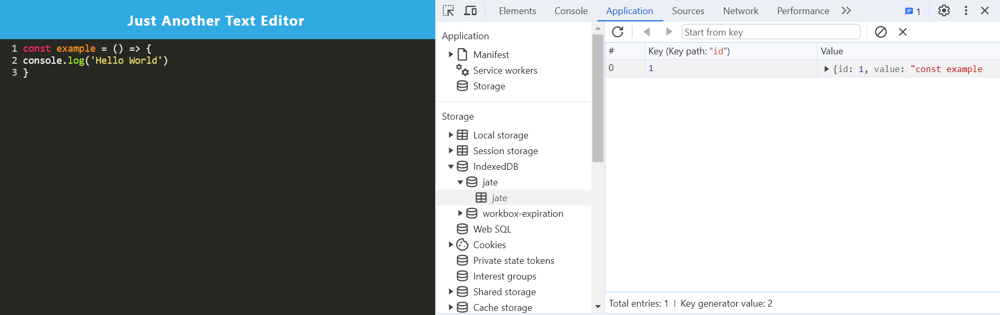

# PWA-Application
## Description
This application is a text/code editor that runs in the browser and follows PWA criteria that allows it to function even when offline.
It is also installable on a computer.
## Table of Contents

- [Description](#description)
- [Installation](#installation)
- [Usage](#usage)
- [Questions](#questions)
## Installation
Visit the [deployed application](https://sleepy-sands-40695-90409c15eb50.herokuapp.com/) and click the install button in the top-left corner.

## Usage
The editor is able to detect and style javascript syntax. Whatever is typed into the editor is automatically saved in an IndexedDB database so that it is preserved on a user's next visit to the website.

## Questions
For any questions you can reach out to me at:

My Email: [ziad.t.alfadl@gmail.com](mailto:ziad.t.alfadl@gmail.com)

My GitHub: [https://github.com/Z-Alfadl](https://github.com/Z-Alfadl)
